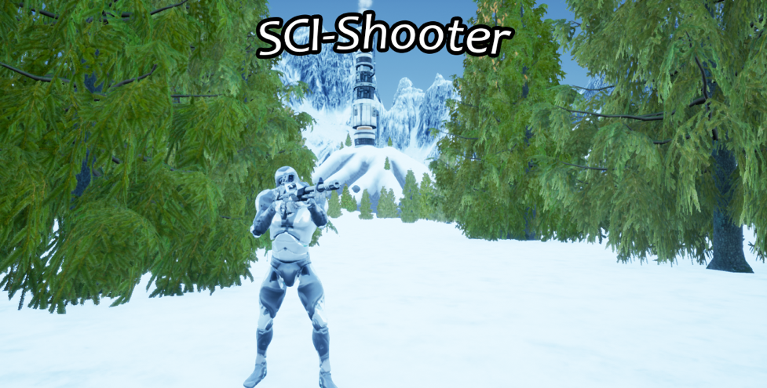

# Sci-Shooter

Een game gemaakt door Timon Klein Gunnewiek, Stijn Klein Gunnewiek, Wouter Pleijsier en Youri Dijk als school project.

## Gebruikte assets / used assets
- [Animation Starter Pack](https://www.unrealengine.com/marketplace/en-US/product/animation-starter-pack)
- [Paragon: Wraith](https://www.unrealengine.com/marketplace/en-US/product/paragon-wraith)
- [Polar Facility Sci-Fi](https://www.unrealengine.com/marketplace/en-US/product/polar-sci-fi-facility)
- [Procedural Nature Pack](https://www.unrealengine.com/marketplace/en-US/product/procedural-nature-pack-vol)
- [Sci-Fi Weapons Silver](https://www.unrealengine.com/marketplace/en-US/product/sci-fi-weapons-silver)
- [Set of grenades (Plasma, Flame and AP grenades)](https://sketchfab.com/3d-models/set-of-grenades-plasma-flame-and-ap-grenades-c71439ebd823432683e5b125d5c24840)
- [Temperate Vegetation: Srpuce Forest](https://www.unrealengine.com/marketplace/en-US/product/interactive-spruce-forest)

## License
This software is Licensed under GPL v3.0. See LICENSE for more information